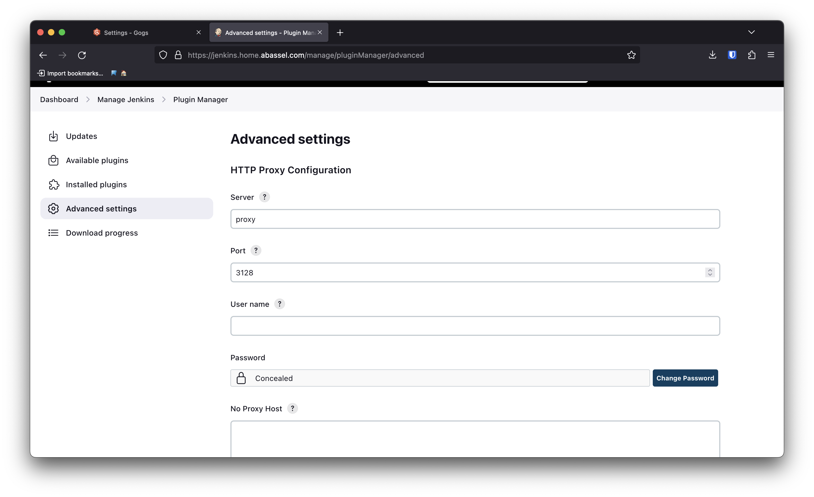
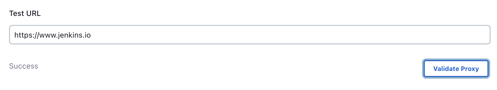

# Jenkins

### Proxy install

- go to > **Manage Jenkins** > **Plugin Manager** > **Advanced Settings**
- set server to **proxy**
- set port to **3128**
- test proxy with **https://www.jenkins.io**

